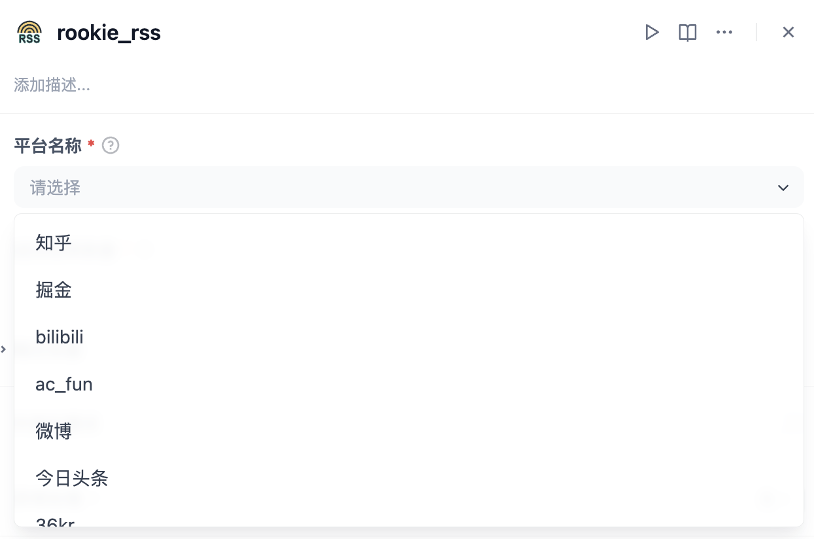

## rookie_rss

> 一款多平台新闻聚合插件

**Author:** jaguarliuu
**Version:** 0.0.1
**Type:** tool

### Description
本插件信息来源基于开源项目[DailyHotApi](https://github.com/imsyy/DailyHotApi)
方便用户无代码的方式获取多平台热搜与热点新闻。

### Steps
1. 下载/安装插件
2. 配置DailyHotApi地址，默认为`https://api-hot.imsyy.top/`

    > DailyHotApi 的手动部署请参考[DailyHotApi](https://github.com/imsyy/DailyHotApi)
    >

3. 在工作流中引入，并完成选择平台和数量即可

